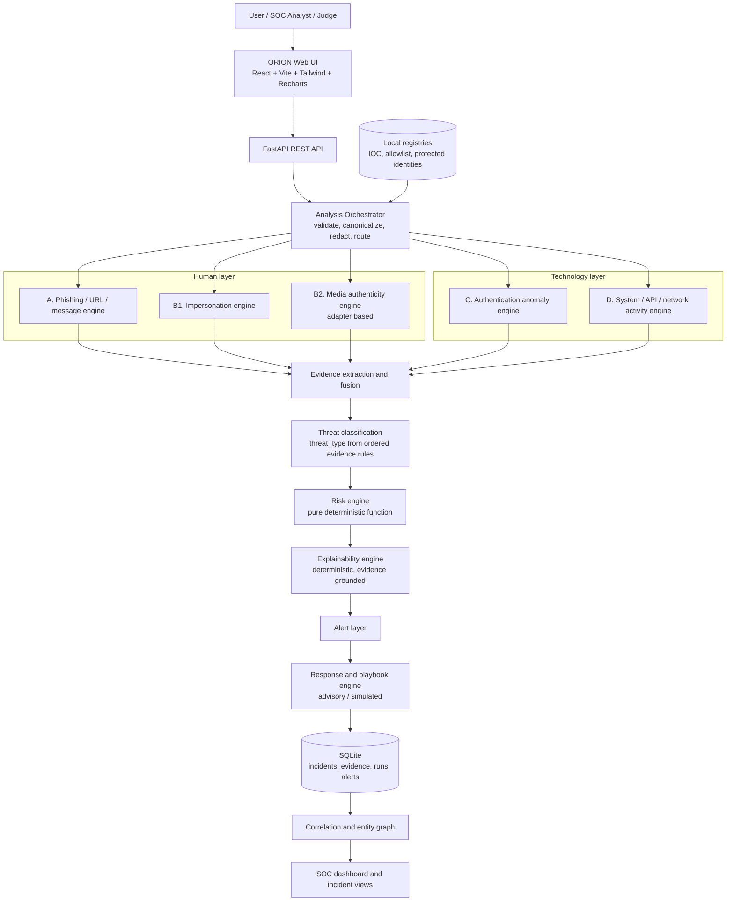
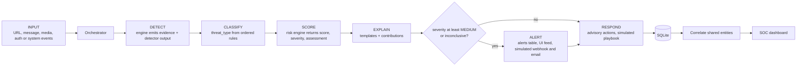
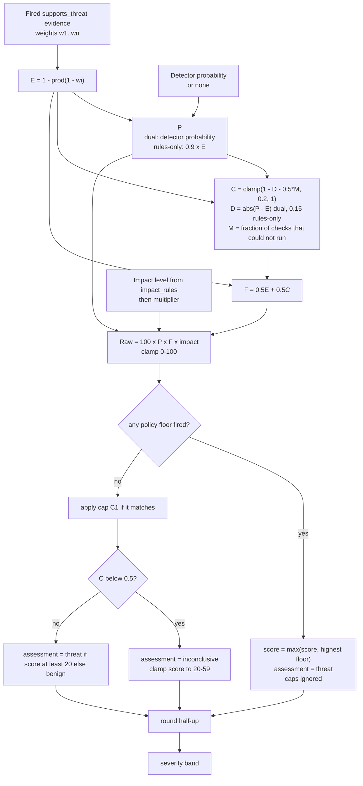
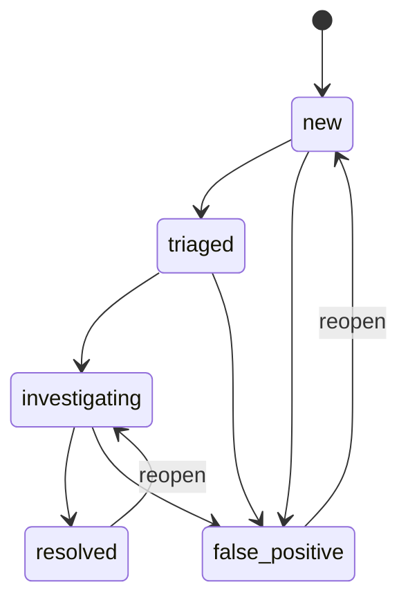
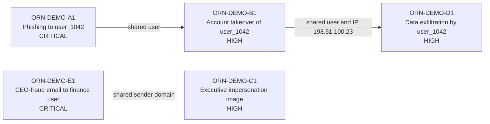
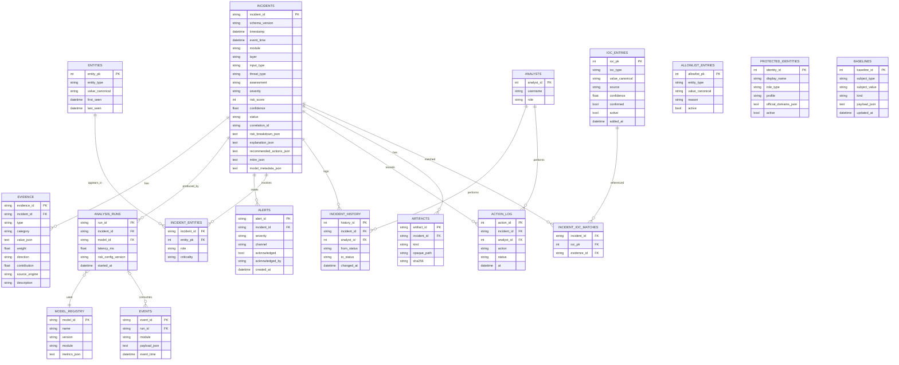
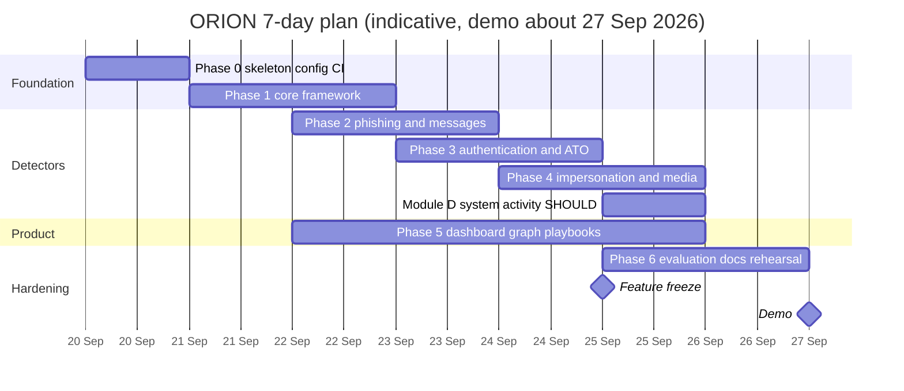

# ORION — Master Project Documentation v3.3

**AI-Powered Cyber Threat Intelligence & Digital Trust Platform**
*From Digital Signals to Actionable Threats.*

Self-contained engineering specification, aligned line by line with **BPUT Hackathon PS09: CYBERGUARD** and re-planned for a **7-day build (demo ≈ Sunday 27 September 2026)**.

---

## 0. Document control

| Item | Value |
|---|---|
| Document | ORION Master Project Documentation **v3.3** (self-contained; v3.1 annex A–V is folded in, there is no layered annex) |
| Date | 20 September 2026 |
| Contract | **1.2** (additive over 1.1; base text in `docs/contract-v1.1.md`, deltas in section 5) |
| Risk config | **risk-cfg-1.1** (`risk_config.yaml`, normative for numbers and rule logic) |
| Golden fixtures | Set v2: A0, A1, A2, B0, B1, B2, B3, **B4**, C1, C2, **D1**, **E1** (verified, section 8.5) |
| Demo target | ≈ Sun 27 Sep 2026 (assumption: "about one week"; shift dates if different) |
| Build agent | Antigravity, governed by `AGENTS.md` |
| Sources | ORION v2.0, v3.0, v3.1 (+ annex), contract/risk addendum, `AGENTS.md`, PS09 problem statement |

**Authority:** this document is the primary integrated specification for architecture, scope, phases and product behavior. `docs/contract-v1.1.md` plus the v1.2 deltas here are normative for the API/data contract. `risk_config.yaml` is normative for numerical values and rule logic that it defines. Code implements these sources. Conflicts stop work and are reported.

### 0.1 What changed from v3.1

| # | Change | Why |
|---|---|---|
| 1 | Full PS09 traceability matrix (section 2); every PS line item has a decision, tier, phase and artifact | "Cover everything in PS09" |
| 2 | Scope grew from 3 modules to Modules A–D: added message/email, QR, HTML-snippet, impersonation (identity/text), password spraying, system/API/network activity | PS scenarios 1–6, deliverable list, dashboard list |
| 3 | 7-day plan with checkpoints, parallel streams, cut line and feature freeze (section 16) | Demo in ~1 week |
| 4 | **Bug fix:** a policy floor now wins over the inconclusive clamp (new golden case B4) | v3.1 downgraded a privileged ATO to 59/MEDIUM when confidence was low |
| 5 | Classification rules defined (`threat_type`, `assessment`) and executable in `risk_config.yaml` | CLASSIFY was undefined |
| 6 | Policy, impact and classification rules are structured and config-driven; the engine takes the config as input | No more free-text conditions or duplicated constants |
| 7 | Leave-one-out **evidence contributions** ("major factors behind the score") | PS section C |
| 8 | MITRE ATT&CK mapping, simulated response playbooks, email sender authenticity, entity graph, live replay feed, evaluation page | PS innovation list |
| 9 | Registries: IOC (with `confirmed`), allowlist, protected identities; canonicalization rules | F4/C1 and impersonation need storage |
| 10 | Deliverable docs for PS items 8–12 scheduled as work items | PS "Minimum Deliverables" |

---


### 0.2 v3.3 correction log

| # | Correction | Resolution |
|---|---|---|
| 1 | Authority wording could imply that the master replaces external normative files | Master is the primary integrated specification; contract and `risk_config.yaml` remain normative in their domains |
| 2 | Tier 0 media could lack `authenticity_score` when no model probability existed | Rules-only media uses `P = 0.9 × E`; the value is explicitly a heuristic estimate, not proof |
| 3 | Evidence-contribution wording conflicted on `P` in rules-only mode | Dual mode holds detector `P`; rules-only recomputes `P = 0.9 × E`; impact/policy state remain fixed |
| 4 | Simulated playbooks appeared to introduce an invalid incident status | Simulation updates action status and `simulated_at`; incident lifecycle status remains unchanged |
| 5 | 48h freeze differed from the general ≥72h recommendation | The 48h freeze is explicitly documented as a deliberate seven-day-schedule exception |
| 6 | Module D cut could be confused with a missing required dashboard category | Technical/system dashboard category remains visible and reports zero/not implemented when D is cut |


## 1. Product identity

| Item | Definition |
|---|---|
| Name | ORION |
| Description | AI-Powered Cyber Threat Intelligence & Digital Trust Platform |
| Core idea | Convert scattered digital security signals into explainable, prioritized, actionable incidents |
| PS concept | CYBERGUARD (PS09). ORION is the product identity; CYBERGUARD is the requirement context |
| Two layers | **Human layer** (phishing, impersonation, deepfake) and **technology layer** (account takeover, system/API/network abuse). This is the PS "Desired Impact" statement made visible in the dashboard |
| Demo chain | INPUT → DETECT → CLASSIFY → SCORE → EXPLAIN → ALERT → RESPOND |

Bounded prototype: not a SIEM/EDR replacement; no exploitation, credential theft or unauthorized scanning; no claim of perfect deepfake detection; no destructive autonomous remediation.

---

## 2. PS09 traceability matrix

**Tier legend**
- **MUST**: needed for the PS minimum prototype and the demo. Never cut.
- **SHOULD**: built if the checkpoint for its phase passes (section 16.3).
- **COULD**: built only after every SHOULD in the phase is done.
- **ROADMAP**: designed-for and documented with an extension point, deliberately not built.

**What "covering everything" means here.** Every PS09 line item gets an explicit decision, an owning phase and a demo/doc artifact. Items marked ROADMAP (for example federated learning or autonomous agents) are documented, not implemented: building them in seven days would endanger the three required scenarios, and autonomous action violates the advisory-only safety boundary.

### 2.1 Key threat scenarios (PS "Key Threat Scenarios")

| PS item | ORION realization | Tier | Phase |
|---|---|---|---|
| **1. Phishing:** emails | `POST /analyze/phishing` with `message` (channel `email`, sender, reply-to, subject, body, pasted headers) | MUST | 2 |
| SMS / messages / social messages | Same endpoint, `channel` = `sms` or `social_message` | MUST | 2 |
| QR-code phishing | `POST /analyze/qr`: offline QR decode → URL → phishing engine (`qr_source` evidence) | SHOULD | 2 |
| Fraudulent websites | Static URL analysis + optional pasted HTML snippet (fake login form, cross-domain form action). No fetching | MUST (URL), SHOULD (HTML) | 2 |
| Malicious / deceptive URLs | URL feature + rule + ML engine | MUST | 2 |
| Indicators: urgency, impersonation, suspicious domains, malicious links, credential requests, unusual communication patterns | Evidence types `urgency_language`, `impersonation_language`, `brand_lookalike`, `redirect_param`, `credential_request_text`, `first_time_sender`, `reply_to_mismatch` | MUST | 2 |
| **2. Deepfake:** images | Media adapter Tier 0: metadata, ELA, file-signature checks | MUST | 4 |
| Videos | Tier 0: container metadata + sampled-frame checks (via opencv, ADR) | SHOULD | 4 |
| Voice / audio clips | Tier 0: WAV spectral features (numpy only) | COULD | 4 |
| Video calls | Analysis of a recorded clip or screenshot. Live call analysis is ROADMAP | SHOULD (recorded) / ROADMAP (live) | 4 |
| AI-generated multimedia | Generic image/video manipulation checks; pretrained model only via an ADR-gated Tier 1 adapter | COULD | 4 |
| Authenticity/confidence score + highlighted indicators | `features.authenticity_score = 1 − P` when the adapter yields P, evidence list, and a stored **ELA heatmap** artifact shown in incident detail | MUST (image) | 4 |
| **3. Impersonation:** government officials, senior management, teachers/university authorities, financial institutions, organisations/brands, friends/relatives | `POST /analyze/impersonation` + **protected-identity registry** seeded with three profiles (academic, government, enterprise) plus finance/brand entries; friends/relatives via `new_contact_claim` pattern | MUST | 4 |
| Analyse identity, communication style, metadata, behavioural patterns | `display_name_spoof`, `official_domain_mismatch` (identity); `style_deviation` (stylometric baseline vs known-sender samples); header metadata; `first_time_sender` (behaviour) | MUST (identity, metadata), SHOULD (style) | 4 |
| **4. Credential theft & ATO:** multiple failed logins | `failed_burst`, `success_after_failures` | MUST | 3 |
| Password spraying | `password_spraying` (one source IP failing across many users) | MUST | 3 |
| Unusual locations, new/unknown devices | `new_location`, `impossible_travel`, `new_device`, `ip_novelty` | MUST | 3 |
| Suspicious session activity | `session_anomaly` | MUST | 3 |
| Sudden changes in account behaviour | `sudden_behavior_change` (z-score vs per-user baseline) | SHOULD | 3 |
| **5. Malicious URL & website:** domain spoofing / look-alike domains | `brand_lookalike`, `homoglyph_domain`, `punycode`, `sender_lookalike` | MUST | 2 |
| URL manipulation | `url_userinfo_at`, `url_encoding_obfuscation`, `excessive_subdomains`, `long_url`, `special_char_ratio_high` | MUST | 2 |
| Malicious redirects | `redirect_param` (static) plus optional user-supplied redirect chain | MUST | 2 |
| Suspicious SSL / domain characteristics | `cert_anomaly`, `domain_age_young` from **supplied metadata** (dataset or analyst input); when absent they count as missing checks (raises `M`, lowers confidence). No live lookups | SHOULD | 2 |
| Fake login pages | `fake_login_form`, `form_action_cross_domain` from pasted HTML | SHOULD | 2 |
| **6. Intelligent threats:** malware indicators | `known_malicious_hash` via local IOC (file hash). No execution or scanning | COULD | 4 |
| Suspicious network traffic | Flow-record analysis: `beaconing_periodicity`, `port_scan_pattern`, `rare_port_usage` on supplied flow logs | SHOULD | D |
| API abuse | `rate_spike`, `endpoint_enumeration`, `error_burst`, `token_reuse_multi_ip` | SHOULD | D |
| Data-exfiltration behaviour | `outbound_volume_spike`, `new_external_destination`, `off_hours_transfer` (+ floor F5) | SHOULD | D |
| Abnormal user activities / insider threats | `bulk_file_access`, `privileged_action_anomaly`, `sudden_behavior_change` | COULD | D |
| Unusual system / application logs | Isolation Forest benchmark on synthetic log-window features | COULD | D |

Phase "D" is the system-activity module scheduled on Day 5 (section 16).

### 2.2 Expected-solution modules A–F

| PS module | ORION realization | Tier |
|---|---|---|
| **A. Multi-source analysis engine:** emails, SMS/messages, URLs, images, audio, videos, authentication logs, system logs, network traffic, API logs | Input adapters (`input_type`): `email`, `sms`, `social_message`, `text`, `url`, `url_text`, `image`, `audio`, `video`, `auth_event`, `system_log`, `network_flow`, `api_log`. Each routes to one engine through the orchestrator | MUST (email, sms, url, image, auth) / SHOULD (video, system, network, api) / COULD (audio) |
| **B. AI-based detection engine:** ML | Calibrated logistic regression on URL features; optional gradient-boosting comparison in the ablation | MUST |
| Deep learning | Only via ADR-gated pretrained media adapter (Tier 1) | COULD |
| NLP | TF-IDF (word + char n-gram) text classifier for phishing/impersonation language; stylometric baseline | MUST |
| Computer vision | ELA, metadata, QR decode, sampled-frame checks | MUST (ELA) |
| Speech/audio analysis | WAV spectral features | COULD |
| Large language models | Optional wording polish and synthetic test-message generation behind adapters; never scoring | COULD |
| Behavioural analytics | Per-user auth baselines; activity z-scores | MUST |
| Anomaly detection | Isolation Forest benchmark for auth (and system windows) | SHOULD |
| Graph analytics | Entity graph, degree centrality, correlation groups, attack-constellation view | SHOULD |
| Hybrid rule + AI | Dual mode (detector `P` + rule evidence `E`) with rules-only fallback | MUST |
| **C. Threat risk scoring** Safe→Low→Medium→High→Critical, with major factors explained | Risk engine (section 8); `explanation.top_factors` from leave-one-out contributions | MUST |
| **D. Explainable AI**, e.g. "High Risk: sender domain resembles an authorised organisation, urgent credential verification, URL redirects to an unrelated domain" | Deterministic evidence-to-sentence templates (section 9.1); ML insight panel (top model feature contributions); deepfake indicators listed with the ELA heatmap | MUST |
| **E. Response recommendation:** block URL, quarantine email, warn user, require additional authentication, revoke session, block IP/device, flag multimedia for manual verification, report impersonation, notify admin/SOC, escalate | Action enum and mapping (section 9.3); every listed action exists in the enum | MUST |
| **F. Command dashboard:** total events, threats detected, threat category, risk level, phishing attempts, impersonation attempts, suspected deepfakes, ATO attempts, attack timeline, frequently targeted users/services, recommended actions, incident status | Overview widgets and endpoints (section 10.3) | MUST |

### 2.3 Minimum prototype and deliverables

| PS deliverable | Artifact | Tier | Phase |
|---|---|---|---|
| Minimum prototype: ≥3 scenarios (phishing/social engineering, impersonation/deepfake/identity fraud, technical or abnormal behaviour); chain Detection → Classification → Risk → Explanation → Alert → Response | Scenarios A (phishing), C/E (impersonation/deepfake), B (ATO) are MUST; D (system) SHOULD | MUST | 2–4 |
| 1. Working prototype | Repository + `scripts/run_demo.sh` (clean start) | MUST | all |
| 2. Threat-detection mechanism | Engines A–D behind adapters | MUST | 2–4 |
| 3. Detection of ≥3 scenarios | Seeded, reproducible demo scenarios | MUST | 6 |
| 4. Risk-scoring mechanism | Section 8, `risk_config.yaml`, golden tests | MUST | 1 |
| 5. Explainable threat assessment | Section 9.1 | MUST | 1 |
| 6. Monitoring dashboard | Section 14 | MUST | 5 |
| 7. Mitigation / response mechanism | Section 9.3 + simulated playbooks | MUST | 1, 5 |
| 8. System architecture | `docs/architecture.md` + rendered diagrams from this document | MUST | 6 |
| 9. Details of models/algorithms | `docs/models.md` (model card per detector: data, features, algorithm, metrics, limits) | MUST | 6 |
| 10. Demonstration on simulated / authorised / public data | `docs/datasets.md` (sources, licences, splits) + seeds | MUST | 2, 6 |
| 11. Accuracy / performance evaluation | `docs/evaluation.md` + `docs/eval/metrics.json` + Evaluation page | MUST | 6 |
| 12. Scalability and deployment approach | `docs/deployment-scalability.md` (outline in section 15.4) | MUST | 6 |

### 2.4 Innovation opportunities

| PS innovation item | ORION treatment | Tier |
|---|---|---|
| Generative-AI-assisted cybersecurity | Optional LLM wording polish behind `explanation.llm_polish`, plus LLM-generated *synthetic* test messages (human-reviewed, labelled synthetic) | COULD |
| AI-generated phishing detection | Text classifier trained on a mix including synthetic LLM-written phishing. No claim of detecting LLM authorship | COULD |
| Multimodal deepfake detection | Image + video + audio adapters fused by the common evidence/risk pipeline; pretrained model via ADR | SHOULD (fusion), COULD (model) |
| Voice-cloning detection | Extension point: `audio_spectral_artifacts` evidence slot. No model | ROADMAP (slot only) |
| Email sender authenticity | Static SPF/DKIM/DMARC parsing from pasted `Authentication-Results`, plus From/Reply-To/Return-Path mismatch | SHOULD |
| Digital identity verification | Protected-identity registry + `request_manual_verification` with an out-of-band verification checklist in the response | SHOULD |
| Behaviour-based fraud detection | Auth baselines, BEC pattern (`display_name_spoof` + `payment_request_text`, floor F6), exfil patterns | MUST |
| Explainable AI | Evidence-first design, contributions, ML insight | MUST |
| Graph-based cyberattack analysis | Entity graph + attack-chain correlation (section 11) | SHOULD |
| Real-time threat intelligence | Local IOC/allowlist store, replay-driven live feed. Live external feed = ROADMAP (needs authorized outbound access) | SHOULD (local + replay) |
| MITRE ATT&CK mapping | Static mapping table (section 9.2), chips in incident detail | SHOULD |
| Zero-day anomaly detection | Unsupervised Isolation Forest novelty detection (modest claim) | SHOULD |
| Privacy-preserving AI | Local-only inference, no external calls, PII/token redaction in logs and UI, hashed user IDs in demo data | SHOULD |
| Federated learning | Documented extension point in `docs/deployment-scalability.md` | ROADMAP |
| Autonomous cyber-defence agents | Out of scope by the safety boundary; human-in-the-loop playbooks instead | ROADMAP |
| Automated incident-response playbooks | Ordered playbook per threat type; UI "Run playbook (simulated)" writes an action log; nothing real is executed | SHOULD |

### 2.5 Desired impact

Deployable for academic, government and enterprise bodies → registry **profiles** (section 11.3) and the deployment/scalability document. Protects the technology layer and the human layer → `layer` field and dashboard grouping.

---

## 3. Scope tiers and cut line

| Tier | Contents |
|---|---|
| **MUST** | Foundation; contract v1.2; risk engine + policy; explanation; response; alerts; persistence; phishing (URL + message text + headers-light); ATO (incl. spraying); impersonation text + identity registry; image media Tier 0 with ELA heatmap; dashboard with every PS "F" item; evaluation on test split; deliverable docs 8–12; seeded reproducible demo; reset |
| **SHOULD** | Module D (API abuse, exfil, network flow); HTML-snippet fake login; QR decode; email SPF/DKIM/DMARC; video (frame sampling); style deviation; sudden behaviour change; Isolation Forest benchmark; MITRE; playbook simulation; graph view; live replay feed; ML insight; contributions UI; privacy redaction |
| **COULD** | Audio spectral; malware hash IOC; insider-threat rules; pretrained media model (ADR); LLM wording/synthetic-sample generation |
| **ROADMAP** | Live call analysis; voice-clone model; LLM-authorship detection; live external TI feed; federated learning; autonomous agents |

**Cut order when behind schedule** (apply at the checkpoints in section 16.3): 1) COULD items; 2) Module D; 3) video and audio (keep image); 4) QR; 5) graph visual (keep entity table); 6) style deviation; 7) MITRE chips. MUST items are never cut; if a MUST is at risk, stop adding scope and escalate. The dashboard's Technical / system-threat category remains present even if Module D is cut; it shows zero or "not implemented" rather than implying that system-activity analysis exists.

---

## 4. Architecture and pipeline





Stability rules:
- Engines return **evidence + detector output only**; they never compute severity, alerts or actions.
- One analysis produces **one incident from one module**. Cross-module relationships come from correlation (shared entities), not from merging incidents.
- `assessment` is an **output of the risk step** (section 8), not of the engine.
- The risk engine is a pure function (no DB, clock, network, randomness). Policy and impact are resolved from `risk_config.yaml`.
- The UI consumes only the canonical incident.
- External adapters degrade to inconclusive/degraded results, never silent SAFE.

---

## 5. Canonical incident contract v1.2

Base: `docs/contract-v1.1.md` (all v1.1 fields keep their names and meanings). v1.2 is **additive**.

| Area | v1.2 change |
|---|---|
| `schema_version` | `"1.2"` |
| `module` | adds `impersonation`, `system_activity` (values: `phishing`, `impersonation`, `media`, `authentication`, `system_activity`) |
| `layer` (new, derived) | `human` for phishing/impersonation/media; `technology` for authentication/system_activity |
| `input_type` | `url`, `text`, `url_text`, `email`, `sms`, `social_message`, `image`, `audio`, `video`, `auth_event`, `system_log`, `network_flow`, `api_log` |
| `threat_type` | `benign`, `phishing_url`, `phishing_message`, `credential_harvesting`, `brand_impersonation`, `executive_impersonation`, `authority_impersonation`, `contact_impersonation`, `synthetic_media`, `account_takeover`, `brute_force`, `password_spraying`, `anomalous_login`, `api_abuse`, `data_exfiltration`, `insider_threat`, `suspicious_network_activity`, `malware_indicator` |
| `entities[].entity_type` | adds `service`, `phone`, `file_hash` (now: `url`, `domain`, `ip`, `user`, `device`, `email`, `media_asset`, `service`, `phone`, `file_hash`) |
| `evidence[].category` | adds `identity`, `email`, `system` (now: `url`, `text`, `auth`, `media`, `identity`, `email`, `system`, `context`) |
| `evidence[].contribution` (new, optional) | leave-one-out raw-score points attributable to this evidence item; `contribution_pct` = share of the sum |
| `explanation` | adds `top_factors` (evidence IDs ordered by contribution, default 3) and optional `ml_insight` (top model feature contributions, display only) |
| `recommended_actions[].status` | `suggested` \| `simulated` \| `dismissed`; adds optional `simulated_at`. `automated` stays `false` |
| `risk_breakdown` | adds `assessment_reason` (text) and `inconclusive_overridden_by_floor` (bool) |
| `authenticity` (new, optional, media) | `{authenticity_score, artifacts[]}` where artifacts are opaque IDs (e.g. ELA heatmap) |
| `mitre_attack` | populated for the demo scenarios from the static table in section 9.2 |

Delta code (apply on top of the v1.1 models):

```python
class Module(str, Enum):
    phishing = "phishing"
    impersonation = "impersonation"
    media = "media"
    authentication = "authentication"
    system_activity = "system_activity"

class RecommendedAction(BaseModel):
    action: str
    priority: int = Field(ge=1)
    rationale: str
    automated: Literal[False] = False
    status: Literal["suggested", "simulated", "dismissed"] = "suggested"
    simulated_at: datetime | None = None

class Evidence(BaseModel):   # v1.1 fields plus:
    contribution: float | None = None
    contribution_pct: float | None = None
```

Validators (unchanged): severity must match the score band; `inconclusive` results must have `risk_score ≤ 59` (a fired floor makes the assessment `threat`, so there is no conflict); every `explanation.factors[].evidence_ids` must exist in `evidence[]`.

Governance: OpenAPI-generated frontend types; schema-snapshot test; canonical fixtures `docs/fixtures/ORN-DEMO-*.json` validated in CI; incident IDs `ORN-YYYYMMDD-NNNNNN`, seeded demos use fixed IDs (`ORN-DEMO-A1` …).

---

## 6. Evidence catalog

Weights live only in `risk_config.yaml`. Engines emit an evidence item when its condition fires, with `type` exactly as below.

| Module | Group | Evidence types (all static/offline) |
|---|---|---|
| Phishing | URL shape | `ip_host`, `punycode`, `homoglyph_domain`, `excessive_subdomains`, `suspicious_port`, `long_url`, `special_char_ratio_high`, `url_userinfo_at`, `url_encoding_obfuscation`, `no_https`, `suspicious_tld` |
| | Deception | `brand_lookalike`, `sender_lookalike`, `credential_path`, `redirect_param` |
| | Text / NLP | `urgency_language`, `credential_request_text`, `payment_request_text`, `impersonation_language`, `suspicious_cta` |
| | Email metadata | `spf_fail`, `dkim_fail`, `dmarc_fail`, `reply_to_mismatch`, `first_time_sender`, `link_text_mismatch` |
| | HTML snippet | `fake_login_form`, `form_action_cross_domain` |
| | Supplied context | `domain_age_young`, `cert_anomaly` (only when metadata is supplied; else counted in `M`) |
| | QR | `qr_source` |
| Impersonation | Identity | `display_name_spoof`, `official_domain_mismatch`, `executive_claim`, `authority_claim`, `new_contact_claim` |
| | Style / behaviour | `style_deviation`, `first_time_sender`, `reply_to_mismatch` |
| | Text | `payment_request_text`, `credential_request_text`, `urgency_language` |
| Authentication | Burst / sequence | `failed_burst`, `success_after_failures`, `password_spraying`, `login_velocity` |
| | Novelty | `new_device`, `new_location`, `ip_novelty`, `unrecognized_user_agent`, `impossible_travel` |
| | Behaviour | `unusual_time`, `session_anomaly`, `sudden_behavior_change` |
| Media | Metadata | `exif_missing`, `editing_software_tag`, `file_signature_mismatch`, `container_metadata_anomaly` |
| | Signal | `ela_inconsistency`, `video_frame_inconsistency`, `audio_spectral_artifacts`, `adapter_manipulation_flag` |
| | Context | `lookalike_sender_identity`, `identity_mismatch`, `payment_or_urgent_request_context` |
| System activity | API | `rate_spike`, `endpoint_enumeration`, `error_burst`, `token_reuse_multi_ip` |
| | Exfil / insider | `outbound_volume_spike`, `new_external_destination`, `off_hours_transfer`, `bulk_file_access`, `privileged_action_anomaly` |
| | Network | `beaconing_periodicity`, `port_scan_pattern`, `rare_port_usage` |
| | Malware | `known_malicious_hash` |

Evidence item shape (v1.1, unchanged): `evidence_id, type, category, value, weight, direction, source_engine, description` (+ v1.2 `contribution`). Only `supports_threat` evidence feeds `E`.

---

## 7. Detection modules

### 7.1 Module A — Phishing, URL and message intelligence (Phase 2)

- **Inputs:** `url`; `message` `{channel: email|sms|social_message|text, sender, reply_to, subject, body, headers?}`; optional `html_snippet`, `redirect_chain`, `domain_metadata {domain_age_days, cert_issuer, cert_valid}`; QR image via `/analyze/qr`.
- **Engines:** (1) URL parser/features; (2) rule indicators; (3) text classifier (TF-IDF + calibrated logistic regression) for urgency/credential/payment/impersonation language; (4) URL classifier (calibrated logistic regression on URL features, gradient-boosting comparison in ablation); (5) email header parser (SPF/DKIM/DMARC from `Authentication-Results`, From/Reply-To/Return-Path mismatch); (6) HTML snippet analyzer (`html.parser` from the standard library: password field, form action domain ≠ page domain, link text ≠ href).
- **Detector output (`P`):** dual mode = calibrated probability (mean of the URL and text model probabilities when both apply, otherwise the one that applies). Rules-only fallback when no model is loaded.
- **Hard constraints:** offline and deterministic. No fetching, following, resolving or crawling. Registered-domain parsing uses a bundled suffix list. Redirect evidence is static.
- **Model insight:** for the linear models, `features.ml_insight` = top-5 (coefficient × feature value).

### 7.2 Module B1 — Impersonation (Phase 4)

- **Input:** `message` (as above) plus optional `claimed_identity` and `known_sender_samples[]`.
- **Registry match:** display name and claimed role are matched (normalized, fuzzy via `rapidfuzz`) against `PROTECTED_IDENTITIES`; the sender domain is checked against that identity's official domains.
  - Display-name match + non-official domain → `display_name_spoof`, `official_domain_mismatch`.
  - Role phrases (CEO, director, principal, registrar, tax/police/government-notice patterns, bank/finance-institution patterns) → `executive_claim` or `authority_claim`.
  - "New number / new account" plus a request to send money → `new_contact_claim` (friend/relative scenario).
  - `style_deviation`: cosine distance of char n-gram TF-IDF between the message and the known-sender samples (SHOULD).
- **`P`:** calibrated text-classifier probability (impersonation/BEC language model). Rules-only fallback available.
- **Impact:** `executive_or_official`, `public_authority`, `sandbox` context flags are set from the registry match.

### 7.3 Module B2 — Media authenticity (Phase 4)

Adapter contract (frozen in Phase 4, no model dependency invented):

```python
class MediaAnalysisAdapter(Protocol):
    name: str
    version: str
    def supports(self, media_type: str) -> bool: ...
    def analyze(self, asset: MediaAsset, context: dict) -> AdapterResult: ...

@dataclass(frozen=True)
class AdapterResult:
    status: Literal["ok", "degraded", "unavailable"]
    p_manipulated: float | None            # None => rules-only mode
    evidence: list[EvidenceDraft]
    missing_checks: list[str]              # feeds M = len(missing)/len(expected)
    artifacts: list[ArtifactRef]           # e.g. ELA heatmap
```

`unavailable` → the orchestrator emits an **inconclusive** incident with an alert; it never emits SAFE.

| Tier | Image | Video | Audio |
|---|---|---|---|
| **Tier 0** (deterministic, ships) | File-signature vs extension, EXIF present/absent, editing-software tag, ELA inconsistency + heatmap | Container metadata anomaly; N sampled frames (default 8) through the image checks; frame-to-frame inconsistency | WAV only: spectral flatness, high-frequency cutoff (numpy FFT) |
| **Tier 1** (optional, ADR-gated) | Pretrained manipulation model | Pretrained model on frames | Pretrained anti-spoof model |

Tier 1 needs an ADR naming model, licence/source, modality, runtime/latency, evaluation data, threshold and fallback. Until then `p_manipulated = None` and the result is rules-only (`P = 0.9 × E`).

Authenticity: `authenticity_score = 1 − P` whenever `P` is resolved. For Tier 0 rules-only media, `P = 0.9 × E`; for Tier 1, `P` comes from the approved adapter/model. The UI always shows the score together with confidence `C` and the evidence list, and labels it **heuristic authenticity estimate, not proof**.

### 7.4 Module C — Authentication anomaly / ATO (Phase 3)

Event schema: `{event_id, user_id, timestamp, event_type: login_success|login_failure|logout|session_activity, ip, device_id, user_agent, geo{country, city, lat, lon}?, auth_method, session_id, privileged?}`.

Features come from a **sliding window with an injectable clock** and a per-user baseline (`BASELINES`): known devices/IPs/countries, usual hours, typical activity volume.

| Evidence | Default detector rule (thresholds live in `detector_config.yaml`) |
|---|---|
| `failed_burst` | ≥ 5 failures for one user within 5 min |
| `success_after_failures` | success within 10 min after a `failed_burst` |
| `password_spraying` | one source IP fails against ≥ 5 distinct users within 10 min, ≤ 2 attempts per user |
| `new_device` / `new_location` / `ip_novelty` | not in the user's baseline |
| `impossible_travel` | consecutive successes implying > 900 km/h from supplied lat/lon (missing geo → counted in `M`) |
| `unusual_time` | outside the user's usual hours (baseline) |
| `login_velocity` | logins per minute above baseline × 5 |
| `session_anomaly` | same session/token used from ≥ 2 IPs or devices |
| `sudden_behavior_change` | activity z-score ≥ 3 vs baseline |

`P`: Isolation Forest anomaly score normalized to 0–1 (optional benchmark). Rules-only otherwise. Synthetic data proves reproducibility, not real-world accuracy; the docs must say so.

### 7.5 Module D — System, API and network activity (SHOULD, Day 5)

Event schema: `{event_id, timestamp, source: api_log|system_log|network_flow, actor, target_service, method, endpoint, status, bytes_out, dst_ip, dst_port, file_hash?, action}`. Analysis is over a **batch/window of supplied records**. ORION never scans or probes anything.

| Evidence | Default rule |
|---|---|
| `rate_spike` | requests/min ≥ 5 × baseline |
| `endpoint_enumeration` | ≥ 20 distinct endpoints with ≥ 70% 4xx in 2 min |
| `error_burst` | 4xx/5xx ratio ≥ 50% over ≥ 30 requests |
| `token_reuse_multi_ip` | same token from ≥ 3 IPs in 5 min |
| `outbound_volume_spike` | bytes_out z-score ≥ 3 vs actor baseline |
| `new_external_destination` | destination not in actor's baseline |
| `off_hours_transfer` | large transfer outside usual hours |
| `bulk_file_access` | ≥ 50 distinct files in 10 min |
| `beaconing_periodicity` | coefficient of variation of inter-arrival times ≤ 0.1 over ≥ 10 connections |
| `port_scan_pattern` | one source to ≥ 20 distinct ports in 1 min (in supplied flow logs) |
| `known_malicious_hash` | file hash matches an active confirmed IOC (COULD) |

`P`: rules-only by default; optional Isolation Forest on window features.

---

## 8. Risk engine and policy (risk-cfg-1.1)

### 8.1 Definitions (unchanged formula)

`F = 0.5·E + 0.5·C`, `Raw = 100 · P · F · Impact`, clamp 0–100, round half-up, bands 0–19 SAFE, 20–39 LOW, 40–59 MEDIUM, 60–79 HIGH, 80–100 CRITICAL.

| Symbol | Meaning | Computation |
|---|---|---|
| E | Evidence strength | Noisy-OR over fired `supports_threat` evidence: `1 − Π(1 − wᵢ)` |
| P | Threat probability | Dual mode: calibrated detector probability. Rules-only: `0.9 × E` |
| C | Confidence | `clamp(1 − D − 0.5·M, 0.2, 1.0)`; `D = |P − E|` (dual) or `0.15` (rules-only); `M` = fraction of expected checks that could not run |
| Impact | Consequence | 0.80 / 1.00 / 1.15 / 1.25 from **ordered `impact_rules`** (first match wins; context flags come from registries/entity criticality) |

Known limitation (document it): noisy-OR assumes independent evidence; some signals are correlated.

### 8.2 Order of operations (changed in v3.2)



**Why the change (B4):** privileged account, `failed_burst` + `success_after_failures` + `new_device`, rules-only, GeoIP unavailable (`M = 0.9`): `C = 0.40`, raw 57.0. v3.1 order (floor → clamp) gave **59 / MEDIUM / inconclusive**. v3.2 gives **80 / CRITICAL / threat**, because a fired floor is deterministic rule evidence. `confidence` still reports 0.40 and `policy_notes` records the floor.

### 8.3 Policy rules (from `risk_config.yaml`)

| Rule | Condition | Effect |
|---|---|---|
| F1 `ato_privileged_success_after_failures` | `success_after_failures` + context `privileged_account` | floor 80 |
| F2 `ato_takeover_pattern` | `success_after_failures` + (`new_device` or `new_location`) | floor 60 |
| F3 `phish_ip_cred_lookalike` | `ip_host` + `credential_path` + (`brand_lookalike` or `punycode`) | floor 65 |
| F4 `ioc_match` | context `ioc_match_confirmed` (active, confirmed IOC) | floor 60 |
| F5 `exfil_volume_new_destination` | `outbound_volume_spike` + `new_external_destination` | floor 60 |
| F6 `bec_display_name_payment` | `display_name_spoof` + `payment_request_text` | floor 60 |
| C1 `allowlist_benign` | context `allowlist_match` and neither `credential_request_text` nor `payment_request_text` | cap 19 (ignored when a floor fired) |
| C2 inconclusive | `C < 0.5` and no floor | assessment `inconclusive`, score clamped 20–59, action `request_manual_verification` |

Any floor/cap that changes the score is recorded in `risk_breakdown` and `explanation.policy_notes`.

### 8.4 Classification (CLASSIFY step)

- `threat_type`: ordered rules per module, first match wins (`classification.threat_type_rules`).
- `assessment`: `inconclusive` if `C < 0.5` and no floor fired; else `threat` if final score ≥ 20; else `benign`.

### 8.5 Reference implementation (verified against all golden cases)

```python
# backend/app/risk/engine.py — pure; config injected (loaded from risk_config.yaml)
from dataclasses import dataclass
from math import prod

@dataclass(frozen=True)
class RiskInputs:
    weights: tuple[float, ...]
    p_model: float | None
    missing_ratio: float
    impact: float
    floor: int | None = None
    cap: int | None = None

def severity(score: int, cfg: dict) -> str:
    for name, (lo, hi) in cfg["severity_bands"].items():
        if lo <= score <= hi:
            return name
    raise ValueError(score)

def compute_risk(x: RiskInputs, cfg: dict) -> dict:
    f_cfg, conf = cfg["formula"], cfg["formula"]["confidence"]
    a = cfg["classification"]["assessment"]
    e = 1 - prod(1 - w for w in x.weights)                      # empty -> 0.0
    if x.p_model is None:
        p, d = f_cfg["probability"]["rules_only_multiplier"] * e, conf["disagreement_rules_only"]
    else:
        p, d = x.p_model, abs(x.p_model - e)
    c = min(conf["max"], max(conf["min"], 1 - d - conf["missing_check_penalty"] * x.missing_ratio))
    f = f_cfg["fusion"]["evidence_weight"] * e + f_cfg["fusion"]["confidence_weight"] * c
    raw = 100 * p * f * x.impact
    score = min(f_cfg["score"]["clamp_max"], max(f_cfg["score"]["clamp_min"], raw))
    inconclusive = False
    if x.floor is not None:                                     # floors win; assessment = threat
        score = max(score, x.floor)
    else:
        if x.cap is not None:
            score = min(score, x.cap)
        if c < a["inconclusive_c_below"]:
            inconclusive = True
            score = min(max(score, a["inconclusive_min_score"]), a["inconclusive_max_score"])
    final = int(score + 0.5)                                    # half-up, not banker's rounding
    assessment = "inconclusive" if inconclusive else ("threat" if final >= a["threat_min_score"] else "benign")
    return {"p": p, "e": e, "c": c, "f": f, "raw": raw, "final": final,
            "severity": severity(final, cfg), "assessment": assessment, "inconclusive": inconclusive}

def _match(cond: dict, fired: set[str], ctx: dict) -> bool:
    return (all(k in fired for k in cond.get("all_of", []))
            and (not cond.get("any_of") or any(k in fired for k in cond["any_of"]))
            and not any(k in fired for k in cond.get("none_of", []))
            and all(ctx.get(k, False) for k in cond.get("context", [])))

def resolve_policy(module: str, fired: set[str], ctx: dict, cfg: dict):
    floors = [(r["floor"], n) for n, r in cfg["policy"]["floors"].items()
              if r["module"] in (module, "any") and _match(r, fired, ctx)]
    caps = [(r["cap"], n) for n, r in cfg["policy"]["caps"].items()
            if r["module"] in (module, "any") and _match(r, fired, ctx)]
    return (max(floors) if floors else (None, None)), (min(caps) if caps else (None, None))

def resolve_impact(module: str, fired: set[str], ctx: dict, cfg: dict):
    for r in cfg["impact_rules"][module]:
        if _match(r, fired, ctx):
            return r["level"], cfg["impact_multipliers"][r["level"]]
    raise ValueError("impact_rules must end with a default rule")
```

Threat-type resolution uses the same `_match` over `classification.threat_type_rules` (skip rules whose `input_types` does not include the input type).

**Contributions:** for each fired evidence item, `contribution = raw(all) − raw(all except item)`. In dual mode, hold detector `P` and `M` fixed while removing the evidence item. In rules-only mode, recompute `P = 0.9 × E` after removing the item. Hold impact and policy state fixed for attribution. `contribution_pct = contribution / Σ contributions` when the denominator is positive. `explanation.top_factors` = top 3 by contribution. It is a formula attribution, not causal proof; the UI labels it "score drivers".

### 8.6 Golden cases (normative fixtures, encode in `backend/tests/fixtures/golden_cases.json`)

All run through `resolve_impact`, `resolve_policy` and `compute_risk` from the config. Values below were reproduced by running this exact logic against `risk_config.yaml`.

| Case | Module | Fired evidence | Context | P | M | Impact | Floor / cap | Raw | **Final** | Severity | Assessment | threat_type |
|---|---|---|---|---|---|---|---|---|---|---|---|---|
| A1 | phishing | `ip_host`, `no_https`, `credential_path`, `brand_lookalike`, `urgency_language`, `credential_request_text` | — | .97 | 0 | HIGH 1.15 | F3 → 65 | 108.6 | **100** | CRITICAL | threat | credential_harvesting |
| A2 | phishing | `credential_path`, `urgency_language`, `excessive_subdomains` | — | .74 | 0 | HIGH | — | 69.4 | **69** | HIGH | threat | credential_harvesting |
| A0 | phishing | — | `allowlist_match` | .02 | 0 | MEDIUM 1.00 | C1 → 19 (not binding) | 1.0 | **1** | SAFE | benign | phishing_url |
| B1 | authentication | `failed_burst`, `success_after_failures`, `new_device`, `new_location`, `unusual_time`, `ip_novelty` | — | .86 | .1 | MEDIUM | F2 → 60 (not binding) | 77.8 | **78** | HIGH | threat | account_takeover |
| B2 | authentication | as B1 | `privileged_account` | .86 | .1 | CRITICAL 1.25 | F1 → 80 (not binding) | 97.3 | **97** | CRITICAL | threat | account_takeover |
| B3 | authentication | `failed_burst`, `success_after_failures`, `new_device` | `privileged_account` | none | .4 | CRITICAL | F1 → 80 | 68.7 | **80** | CRITICAL | threat | account_takeover |
| **B4** | authentication | as B3 | `privileged_account` | none | **.9** | CRITICAL | F1 → 80 | 57.0 | **80** | CRITICAL | **threat** (C = .40) | account_takeover |
| B0 | authentication | — | — | .06 | 0 | MEDIUM | — | 2.8 | **3** | SAFE | benign | anomalous_login |
| C1 | media | `exif_missing`, `editing_software_tag`, `ela_inconsistency`, `lookalike_sender_identity`, `payment_or_urgent_request_context` | `executive_or_official` | .71 | .2 | HIGH | — | 65.7 | **66** | HIGH | threat | executive_impersonation |
| C2 | media | `exif_missing` | — | .55 | .7 | MEDIUM | inconclusive clamp | 11.0 | **20** | LOW | **inconclusive** (alert required) | synthetic_media |
| **D1** | system_activity | `outbound_volume_spike`, `new_external_destination`, `off_hours_transfer`, `bulk_file_access` | `sensitive_service` | none | .2 | HIGH | F5 → 60 (not binding) | 65.9 | **66** | HIGH | threat | data_exfiltration |
| **E1** | impersonation | `display_name_spoof`, `official_domain_mismatch`, `executive_claim`, `payment_request_text`, `urgency_language`, `first_time_sender` | — | .86 | 0 | HIGH | F6 → 60 (not binding) | 92.0 | **92** | CRITICAL | threat | executive_impersonation |

Intermediate values for the pre-existing cases are unchanged from the addendum (A1: E .958, C .988; B1: E .923, C .887; C1: E .849, C .761; etc.).

### 8.7 Property tests

Run against the reference engine with 20 000 random inputs; zero violations:
1. **Bounds:** final score is an integer 0–100.
2. **Determinism.**
3. **Band consistency:** severity always matches the score band (Incident validator rejects mismatches).
4. **Evidence monotonicity — same state only:** with `P`, `M` fixed and no floor/cap transition, adding a `supports_threat` item never lowers the score *when the assessment state (inconclusive or not) is unchanged*. Do **not** assert it across the inconclusive boundary: `P=.3`, weights (.2), `M=.9` gives 20 (inconclusive); adding weight .125 gives 13 (conclusive, benign).
5. **Impact monotonicity** within the same state.
6. **Floor wins:** if a floor fired, the final score ≥ floor and the assessment is not inconclusive.
7. **Unknown is not safe:** an inconclusive result always scores ≥ 20.
8. **Config parity:** golden cases pass when constants are read from `risk_config.yaml`; changing a weight in the YAML changes the result.

Add: explanation-completeness test (every evidence type in the YAML has a template) and contract tests on `docs/fixtures/ORN-DEMO-*.json`.

---

## 9. Explanation, MITRE, response

### 9.1 Deterministic explanation

- Each evidence type has a template sentence (`backend/app/explainability/templates.py`), e.g. `ip_host` → "the URL uses an IP address instead of a domain name"; `success_after_failures` → "a successful login followed a burst of failed attempts"; `display_name_spoof` → "the display name matches a protected identity but the sender domain is not official".
- Summary rule: `"{SEVERITY}-risk {threat label} assessment because {factor 1}, {factor 2} and {factor 3}."` using `top_factors`. Inconclusive: "Inconclusive assessment: {reason}; manual verification recommended."
- `factors[]` = one sentence per evidence group with `evidence_ids`.
- `policy_notes` state any floor/cap/inconclusive override in plain words.
- PS-style example the output must be able to produce: *"High risk: the sender domain closely resembles an authorised organisation, the message requests urgent credential verification, and the embedded URL contains a redirect target."* (all three from stored evidence).
- Optional LLM polish (`llm_polish_v1`) may reword the summary only; it must not add facts, change numbers or alter actions. Off by default.

### 9.2 MITRE ATT&CK mapping (static table, `backend/app/intelligence/mitre_map.yaml`)

Verify IDs against the current ATT&CK version before publishing. Leave a threat type unmapped rather than force-fit.

| threat_type | Techniques |
|---|---|
| `phishing_url`, `phishing_message` | T1566 Phishing (T1566.002 Spearphishing Link when a URL is present) |
| `credential_harvesting` | T1566, T1598 Phishing for Information |
| `brand_impersonation` | T1656 Impersonation; T1583.001 Acquire Infrastructure: Domains (lookalike domain) |
| `executive_impersonation`, `authority_impersonation`, `contact_impersonation`, `synthetic_media` | T1656 Impersonation |
| `account_takeover` | T1078 Valid Accounts, T1110 Brute Force |
| `brute_force` | T1110 |
| `password_spraying` | T1110.003 Password Spraying |
| `anomalous_login` | T1078 |
| `data_exfiltration` | T1567 Exfiltration Over Web Service (or T1041 when a C2 channel is evidenced) |
| `suspicious_network_activity` | T1071 Application Layer Protocol (beaconing) |
| `api_abuse`, `insider_threat`, `malware_indicator` | unmapped |

### 9.3 Action enum and mapping

Enum: `no_action, monitor, warn_user, block_url, quarantine_message, notify_security_team, require_mfa, revoke_session, block_ip, block_device, notify_user, flag_content, request_manual_verification, report_impersonation, notify_authority, escalate_soc`. This covers every PS "Intelligent Response" action.

| Situation | Recommended actions (in priority order) |
|---|---|
| SAFE | `no_action` |
| Inconclusive (any) | `request_manual_verification`, `monitor` |
| Phishing LOW/MEDIUM | `warn_user`, `monitor`, `quarantine_message`, `notify_security_team` |
| Phishing HIGH/CRITICAL | `block_url`, `quarantine_message`, `notify_security_team`, `escalate_soc` |
| Impersonation, MEDIUM+ | `request_manual_verification`, `flag_content`, `report_impersonation`, `notify_security_team`; CRITICAL adds `escalate_soc`; `notify_authority` when context `public_authority` |
| Media MEDIUM+ | `request_manual_verification`, `flag_content`, `report_impersonation`, `notify_security_team` |
| ATO MEDIUM/HIGH | `require_mfa`, `revoke_session`, `notify_user`, `block_ip`, `block_device` |
| ATO CRITICAL | `require_mfa`, `revoke_session`, `block_ip`, `block_device`, `notify_security_team`, `escalate_soc` |
| System activity MEDIUM | `monitor`, `notify_security_team` |
| System activity HIGH | `block_ip`, `revoke_session`, `notify_security_team`, `escalate_soc` |
| System activity CRITICAL | as HIGH, `escalate_soc` first |

### 9.4 Simulated playbooks

A playbook is the ordered action list above. "Run playbook (simulated)" calls `POST /api/incidents/{id}/actions/{action}/simulate`, which sets the selected `recommended_actions[].status = simulated`, records `simulated_at`, writes `ACTION_LOG`, and appends `incident_history`. The incident lifecycle `status` remains governed by the normal lifecycle (`new`, `triaged`, `investigating`, `resolved`, `false_positive`). **Nothing real is executed.** `automated` stays `false`.

---

## 10. Alerts, lifecycle, dashboard semantics

### 10.1 Alerts

Raised when `severity ≥ MEDIUM` **or** `assessment = inconclusive`. Schema: `alert_id, incident_id, severity, channel (ui|webhook_sim|email_sim), message, created_at, acknowledged, acknowledged_by`. UI delivery is real; webhook/email are log entries only. C2 (LOW, inconclusive) alerts.

### 10.2 Lifecycle



Every analysis creates an incident (including SAFE). `false_positive` is analyst feedback and becomes extra labelled data in Phase 6.

### 10.3 PS "F" dashboard metrics → definitions

| PS dashboard item | Definition / source |
|---|---|
| Total events analysed | count of analysis runs |
| Threats detected | `assessment = threat` and `severity ≥ LOW` |
| Threat category | count by `threat_type` |
| Risk level | count by `severity` |
| Phishing attempts | threats where `module = phishing` |
| Impersonation attempts | threats where `module = impersonation` |
| Suspected deepfakes | threats where `module = media` |
| Account takeover attempts | threats where `module = authentication` |
| Technical / system threats | threats where `module = system_activity` |
| Attack timeline | `GET /dashboard/timeline` (incidents by time, colour = severity, grouped by correlation) |
| Frequently targeted users/services | top entities of type `user` or `service` with role `target`/`subject` by incident count (`GET /dashboard/targets`) |
| Recommended actions | top recommended actions across active incidents, plus per-incident |
| Incident status | count by `status` |
| Active incidents | `status ∈ {new, triaged, investigating}` and `severity ≥ LOW` |
| Inconclusive | `assessment = inconclusive` (separate; never counted as SAFE) |
| Layer split | human vs technology by `layer` |

Each incident is counted under exactly one module, so the per-module numbers add up to "Threats detected".

---

## 11. Correlation, entity graph, registries

### 11.1 Correlation and graph

New incident → find incidents sharing any entity within the window (default 24 h) → assign/create `correlation_id`, fill `related_incident_ids`. Correlation **never changes a score** (keeps the risk engine pure); the group carries `group_severity` (max of members) and `group_size`, and a group spanning ≥ 2 modules that contains a HIGH+ incident is flagged **"attack chain"**.

`GET /api/graph` returns nodes (entities + incidents) and edges (`INCIDENT_ENTITIES`) with degree centrality. The UI draws a deterministic radial SVG layout (no extra graph library).

**Demo storyline (one connected constellation):**



Seed all timestamps within one 24 h window and reuse the same entity values so correlation fires deterministically. All IPs use documentation ranges (198.51.100.0/24, 203.0.113.0/24).

### 11.2 Canonicalization (one function, used by IOC matching, allowlist, correlation, entity dedupe)

| Type | Rule |
|---|---|
| domain | lowercase, strip trailing dot, IDNA/punycode normalize, strip `www.` only for matching (keep original in evidence), reverse defanging (`[.]`) |
| url | canonical scheme/host, remove default port, sort nothing, keep path/query as-is, reverse defanging; store defanged for display |
| ip | canonical dotted IPv4 / compressed IPv6 |
| email | lowercase, strip display name |
| phone | E.164-like digits only |
| user / device / service | trimmed, case-sensitive as supplied |
| file_hash | lowercase hex |

### 11.3 Registries (configuration/admin data; no network retrieval)

- `IOC_ENTRIES(ioc_pk, ioc_type, value_canonical, source, confidence, confirmed, active, added_at)`. Only `active AND confirmed` entries set context `ioc_match_confirmed` (F4). Matches are auditable in `INCIDENT_IOC_MATCHES`.
- `ALLOWLIST_ENTRIES(allowlist_pk, entity_type, value_canonical, reason, active)`. Only active entries set `allowlist_match` (C1).
- `PROTECTED_IDENTITIES(identity_id, display_name, role_type, profile, official_domains_json, active)` with profiles **academic** (registrar, dean, professor), **government** (officials, tax/police notice senders), **enterprise** (CEO, CFO, HR), plus finance-institution and brand entries. All entries are fictional/synthetic for the demo.
- `BASELINES(baseline_id, subject_type, subject_value, kind, payload_json, updated_at)` for auth, activity and style baselines.

---

## 12. SQLite data model



Rules: `PRAGMA foreign_keys=ON`, WAL, versioned SQL migrations from Phase 0, JSON as text behind the repository layer. Indexes: `incidents(incident_id, timestamp, module, threat_type, severity, status, correlation_id)`, `evidence(incident_id)`, `analysis_runs(incident_id)`, `entities(entity_type, value_canonical)` unique, `incident_entities(entity_pk)`, `alerts(incident_id, acknowledged)`, `ioc_entries(ioc_type, value_canonical)`, `allowlist_entries(entity_type, value_canonical)`.

---

## 13. API contract

| Endpoint | Purpose | Phase |
|---|---|---|
| `GET /api/health` | health | 0 |
| `GET /api/system/info` | doc/contract/risk-config/model versions | 1 |
| `GET /api/incidents`, `GET /api/incidents/{id}` | list (filters + pagination), detail | 1 |
| `GET /api/alerts` | alert feed (`acknowledged` filter, pagination) | 1 |
| `POST /api/analyze/phishing` | URL and/or message (+ headers, HTML snippet, redirect chain, domain metadata) | 2 |
| `POST /api/analyze/qr` | image with QR → phishing analysis (SHOULD) | 2 |
| `POST /api/analyze/authentication` | one event or a batch | 3 |
| `POST /api/analyze/impersonation` | message + claimed identity + known-sender samples | 4 |
| `POST /api/analyze/media` | multipart image/audio/video | 4 |
| `POST /api/analyze/system` | API/system/network records (SHOULD) | 4/5 |
| `GET /api/dashboard/summary`, `/timeline`, `/threat-distribution`, `/targets` | dashboard data (section 10.3) | 5 |
| `POST /api/alerts/{id}/ack` | acknowledge | 5 |
| `PATCH /api/incidents/{id}/status` | validated lifecycle transition | 5 |
| `POST /api/incidents/{id}/actions/{action}/simulate` | simulated playbook step | 5 |
| `GET /api/incidents/{id}/related`, `GET /api/entities`, `GET /api/graph` | correlation, threat intelligence, graph | 5 |
| `GET /api/incidents/{id}/artifacts/{artifact_id}` | e.g. ELA heatmap | 4 |
| `GET /api/evaluation/summary` | serves `docs/eval/metrics.json` | 6 |
| `POST /api/demo/reset` | reset/reseed demo data; needs `ORION_DEMO_RESET_ENABLED=true` | 6 |

Normative behaviour:
- `GET /api/incidents`: filters `entity`, `module`, `layer`, `severity`, `status`, `after` (cursor for live polling); `page`, `page_size` (bounded); order `timestamp DESC, incident_id DESC`.
- `PATCH …/status`: validate lifecycle; analyst from `X-Analyst-Id` header or default seeded `analyst_demo`; write `incident_history`. The prototype has **no real authentication**; the header is a demo convenience and spoofable. Say so in the docs.
- Errors: one shape `{error:{code,message,details?,request_id}}`; never leak stack traces.
- Frontend types generated from OpenAPI; schema snapshot test in CI.
- Registry data is managed by seed scripts; the UI reads it read-only.

---

## 14. Frontend information architecture

| View | Content |
|---|---|
| **Overview** | Every PS "F" widget (section 10.3): totals, severity and category distributions, module cards (phishing, impersonation, suspected deepfakes, ATO, technical), layer split, attack timeline, frequently targeted users/services, recommended actions, incident status, alert feed |
| **Analyze** | Tabs: URL/Message, Impersonation, Media (upload), Authentication, System/API logs, QR. Each shows the live INPUT → DETECT → CLASSIFY → SCORE → EXPLAIN → ALERT → RESPOND progression and a "load demo sample" button |
| **Incidents** | Filterable table (module, layer, severity, status, entity) with pagination |
| **Incident Detail** | Severity/risk/confidence, `risk_breakdown` (P, E, C, F, impact, floor/cap), evidence table with **score-driver bars** (contributions), features, ML insight, explanation with policy notes, MITRE chips, recommended actions with **Run playbook (simulated)**, ELA heatmap (media), model metadata, status history, related incidents |
| **Threat Intelligence** | Entity table (counts, last seen, IOC/allowlist flags) + graph / attack-constellation view |
| **Timeline** | Chronological activity with correlation groups |
| **Live Feed** | Replay-driven stream (2 s polling of `after` cursor) to show near-real-time detection |
| **Evaluation** | Precision/recall/F1, confusion matrices, ablation, latency, reproducibility check, from `metrics.json` |
| **Settings / System Health** | API health, versions, model registry, demo mode |

UI rules: display defanged URLs; render message text as plain text; inconclusive shown as its own badge (never SAFE); low-confidence badge when `C < 0.5`; a "assessment, not proof" note on media results.

---

## 15. Data, evaluation and deployment documents

### 15.1 Datasets (`docs/datasets.md`; verify every licence/terms and download before Day 3, offline)

| Module | Candidate sources | Notes |
|---|---|---|
| Phishing URLs | Phishing feeds (PhishTank, OpenPhish), benign domains from the Tranco list | Store defanged; never fetch; check feed terms. **Source-split** dev/test so the same source/template/domain family never crosses the split |
| Message text | UCI SMS Spam Collection; Nazario phishing corpus; Enron corpus (benign email); LLM-generated *synthetic* phishing (labelled synthetic, human-reviewed) | Remove personal data; report split method |
| Impersonation | Synthetic BEC/authority/relative messages built against the fictional protected-identity registry | Fully synthetic |
| Authentication | Seeded generator: normal sessions, brute force, spraying, ATO, impossible travel | Fixed seeds; proves reproducibility only |
| System/API/network | Seeded generator; optionally a public flow dataset subset | Fixed seeds |
| Media | Small **authorized/self-made** set: originals plus edited copies with known ground truth (≥ 20 files); public benchmark subsets only if access is already granted | Label everything; no real victims' data |

### 15.2 Evaluation plan (`docs/evaluation.md`, `docs/eval/metrics.json`)

- Classifiers: accuracy (if balanced), precision, recall, F1, confusion matrix on the **test** split; tune on dev only.
- Anomaly detection: precision/recall/F1 on labelled synthetic sessions + false-positive analysis.
- **Ablation** per module: rules-only vs ML-only vs fused.
- Risk calibration: score distributions per class; malicious ≥ MEDIUM rate; benign ≤ LOW rate.
- Platform: API latency and analysis latency (p50/p95), error rate, seeded-scenario reproducibility (run the seed set twice; results identical).
- Near real time: replay events through the API and measure event-to-dashboard latency.
- Targets to *measure and report* (not to claim in advance): p95 analysis < 300 ms for URL/text/auth, image < 2 s, short video < 10 s, event-to-dashboard < 2 s.
- Minimum test sizes: phishing URLs 200, messages 100, auth sessions 200, system windows 100, media 20 files.

### 15.3 Models document (`docs/models.md`, deliverable 9)

One model card per detector: purpose, data, features, algorithm, probability calibration, metrics, limitations. Baselines: calibrated logistic regression (URL), TF-IDF + calibrated logistic regression (text), Isolation Forest (auth/system), heuristic adapter (media), char n-gram similarity (style). Calibrate probabilities (Platt scaling) because the risk engine treats `P` as a probability.

### 15.4 Scalability and deployment (`docs/deployment-scalability.md`, deliverable 12)

Outline to write: (1) demo deployment: single laptop, offline, `scripts/run_demo.sh`, SQLite file backup; (2) containerized: Docker Compose (API, frontend, worker); (3) PostgreSQL via the repository layer; (4) async ingestion queue and worker pool; horizontally scaled stateless API; (5) streaming ingestion (message bus) for logs and events; (6) separate model-serving tier with versioned adapters; (7) multi-tenant registry profiles for academic, government and enterprise deployments; (8) authentication/RBAC, TLS, audit; (9) observability (health, latency, error rate); (10) privacy: on-prem inference, redaction, federated learning as roadmap; (11) known limits of the prototype.

---

## 16. Phased implementation plan (7 days)

**Assumptions:** demo ≈ Sun 27 Sep; team of 3–4 working in four parallel streams (backend-core, detectors, frontend, data/eval/docs) with Antigravity per stream on separate branches; demo on a laptop, offline. With fewer people, apply the cut line earlier.



### 16.1 Day plan

| Day | Date | Focus | Gate reached at end of day |
|---|---|---|---|
| D0 | Sun 20 Sep | Sign off v3.2; record ADRs (dependencies, media tier, LLM on/off, dataset sources); create repo; drop in `AGENTS.md`, `risk_config.yaml`, `docs/`; Phase 0 | — |
| D1 | Mon 21 | Finish Phase 0; Phase 1 (contract, engine, policy, golden tests). Frontend builds shell + Overview against mocked OpenAPI types | Phase 0 gate |
| D2 | Tue 22 | Phase 1 (explanation, response, alerts, persistence, orchestrator with mocked detectors) → **Phase 1 gate by midday**. Then Phase 2 starts; data stream downloads/prepares datasets | **Phase 1 gate** |
| D3 | Wed 23 | Phase 2 finish (phishing + messages + ML + eval); Phase 3 starts in parallel | **Phase 2 gate (checkpoint C2)** |
| D4 | Thu 24 | Phase 3 finish; Phase 4 starts (impersonation text + image Tier 0); dashboard integration | **Phase 3 gate (checkpoint C3)** |
| D5 | Fri 25 | Phase 4 finish; Module D (SHOULD); dashboard/graph/playbooks/live feed; **feature freeze at end of day** | **Phase 4 gate; freeze (checkpoint C4)** |
| D6 | Sat 26 | Phase 6: evaluation on test split, ablation, latency, docs 8–12, reset/reseed, upload safety, two full rehearsals, backup video | **Phase 6 gate** |
| D7 | Sun 27 | Final rehearsal, backups, demo. Critical bug fixes only, each tagged for rollback | Demo |

**ADR-T1 (freeze window):** v3.1 recommended a ≥ 72 h freeze. With a 7-day window, this plan deliberately sets the freeze at **end of D5 (≈ 48 h before the demo)** because the available build window is only seven days. D6–D7 are hardening, evaluation polish, rehearsal and packaging only. If the demo date moves, keep "freeze = demo − 2 days" unless an approved schedule decision changes it.

### 16.2 Phases

**Phase 0 — Foundation and repository baseline (D0–D1).**
Deliverables: frontend/backend skeleton, FastAPI health, React shell, SQLite with migrations + WAL + foreign keys, repository layer, config loading (`risk_config.yaml`), OpenAPI type generation, seed-script skeleton, `AGENTS.md`, `docs/PHASE_STATUS.md`, `docs/adr/`, README, Git baseline, extraction of this document's Mermaid blocks to `docs/diagrams/*.mmd` (one file per diagram, rendered with `mmdc` at documentation-build time).
Exit gate: frontend, backend and database start reliably from a clean clone.

**Phase 1 — Core intelligence framework (D1–D2).**
Deliverables: contract v1.2 Pydantic models + validators; evidence/analysis-run models; canonicalization function; pure risk engine + policy/impact resolvers; classification rules; deterministic explanation with templates and contributions; response engine + simulated playbooks; alerts; persistence; orchestrator with mocked detectors; seed fixtures `ORN-DEMO-*` loaded via the API; OpenAPI snapshot test; golden (12 cases) + property + contract tests.
Exit gate: a mocked analysis travels end to end and appears as a canonical incident with an alert; all Phase 1 tests pass.
PS coverage: risk scoring (4), explainable assessment (5), response mechanism (7), alert step.

**Phase 2 — Module A: phishing, URL, message (D2–D3).**
Deliverables: URL parser/features; rule indicators; text classifier; URL classifier; calibrated probabilities; email-header authenticity (SHOULD); HTML-snippet analysis (SHOULD); QR decode (SHOULD); redirect-param + supplied chain; evidence extraction; `/analyze/phishing` (+ `/analyze/qr`); phishing UI tab; dataset preparation with **source-split**; first eval numbers.
Exit gate: A0/A1/A2 reproduce; safe and malicious samples visibly differ in evidence, score and response; only offline/static analysis; metrics recorded on the test split.
Checkpoint C2 (end D3): if missed, drop QR and HTML snippet, keep URL + message.

**Phase 3 — Module C: authentication anomaly / ATO (D3–D4).**
Deliverables: event schema; baselines; sliding-window features with injectable clock; failed burst, success-after-failures, spraying, novelty, impossible travel, session anomaly, sudden change; rules engine; Isolation Forest benchmark (SHOULD); synthetic generator with fixed seeds; `/analyze/authentication` (single + batch); ATO UI; analyst/status path.
Exit gate: B0/B1/B2/B3/B4 reproduce; normal vs suspicious scenarios reproducible; spraying scenario works.
Checkpoint C3 (end D4): if missed, drop the Isolation Forest and sudden-change rule.

**Phase 4 — Module B: impersonation and media (D4–D5).**
Deliverables: protected-identity registry + seeds (academic/government/enterprise/finance/brand); impersonation engine + `/analyze/impersonation`; `MediaAnalysisAdapter` interface; Tier 0 image checks with ELA heatmap; video frame sampling (SHOULD); audio WAV features (COULD); media upload safety; `/analyze/media`; unavailable adapter → inconclusive + alert; media/impersonation UI; model-choice ADR (only if Tier 1 is attempted).
Exit gate: C1/C2/E1 reproduce; representative media samples give stable results; unavailable adapter yields inconclusive + alert.
Module D (D5, SHOULD): system/API/network engine + `/analyze/system`; D1 reproduces; exfil and API-abuse scenarios seeded.

**Phase 5 — SOC dashboard and correlation (D2–D5, parallel with detectors).**
Deliverables: Overview with every PS "F" widget; incident table with filters + pagination; incident detail (contributions, ML insight, MITRE, playbook simulation, artifacts); timeline; entities + IOC/allowlist flags; correlation + attack-chain flag; graph; status transitions and history; live feed (replay script + polling); Evaluation page.
Exit gate: judges can understand the whole system from one dashboard; the storyline in section 11.1 shows as one constellation.

**Phase 6 — Evaluation, demo hardening and deployment (D5 evening–D6).**
Deliverables: evaluation on the test split, ablation, latency and reproducibility results in `metrics.json`; docs 8–12 (`architecture.md`, `models.md`, `datasets.md`, `evaluation.md`, `deployment-scalability.md`); reset/reseed with the flag; graceful API/model failure states; rendered diagrams; privacy redaction check; two clean-start rehearsals; backup of `orion.db`, model artifacts and seeds; backup demo video; `docs/demo-freeze.md` with the actual date.
Exit gate: full demo repeats from a clean start without manual repair.

### 16.3 Checkpoints and freeze

| Checkpoint | When | Pass condition | If missed |
|---|---|---|---|
| C1 | D2 midday | Phase 1 gate | stop detector work, fix Phase 1 first (everything depends on it) |
| C2 | D3 end | Phase 2 gate | drop QR, HTML snippet |
| C3 | D4 end | Phase 3 gate | drop Isolation Forest, sudden-change rule |
| C4 | D5 end = **feature freeze** | Phase 4 gate + dashboard complete | apply the cut order (section 3); freeze whatever works |

After C4: no new features. Config, seeds, model artifacts, UI copy and API schema are frozen; only tagged bug fixes.

---

## 17. Demo runbook (about 10 minutes)

| Min | Screen | Action | What judges see (PS item) |
|---|---|---|---|
| 0–1 | Overview | Explain the two layers and the chain INPUT → … → RESPOND | Dashboard F items, alert feed |
| 1–3 | Analyze → URL/Message | Submit A0 (safe) then A1 (phishing email + fake-login HTML) | Different evidence, score 1 vs 100, explanation, alert, block/quarantine (scenarios 1 and 5, modules C–E) |
| 3–4 | Incident Detail (A1) | Point to score drivers, ML insight, MITRE chips, run playbook (simulated) | Explainable AI, response, ATT&CK |
| 4–6 | Analyze → Impersonation + Media | E1 (CEO-fraud email) and C1 (edited executive image with ELA heatmap); then an unavailable-adapter case | Impersonation, deepfake indicators, confidence, inconclusive handling |
| 6–7 | Analyze → Authentication | B1, then B2/B4 (privileged), then a spraying batch | Behavioural analytics, floors |
| 7–8 | Analyze → System | D1 exfiltration (if built) | Technology layer |
| 8–9 | Threat Intelligence → graph | Show A1 → B1 → D1 connected through `user_1042` and the shared IP | Graph-based attack analysis |
| 9–10 | Live Feed + Evaluation | Start replay; show event-to-dashboard latency, P/R/F1, ablation | Near real time; deliverable 11 |

Fallbacks: recorded video; `POST /api/demo/reset` (flag enabled on the demo machine only); backup `orion.db`.

---

## 18. Safety, privacy and input handling

- Synthetic, authorized or public data only. No real credentials, tokens or personal data anywhere (repo, logs, fixtures).
- Never fetch, crawl, resolve or follow submitted URLs; parse offline and deterministically. HTML snippets are parsed statically and never rendered or executed. Libraries must not make network calls at runtime.
- Defang URLs in logs, fixtures, documentation and judge-facing output; render message text as plain text.
- Mask emails, phone numbers and tokens in logs; hash user IDs in demo data.
- Uploads: validate size/type, opaque generated filenames, store outside static/executable paths, bounded decoding (size/time limits), never execute content.
- Actions are advisory; playbook "simulate" only writes logs; webhook/email delivery is log-only.
- Unknown or inconclusive results are never displayed as SAFE.
- The prototype has no real authentication (`X-Analyst-Id` is a demo convenience).
- No credential theft, malware, authentication bypass or unauthorized scanning features.

---

## 19. Antigravity operating procedure

Every session starts with: *"Read `AGENTS.md`, `docs/PHASE_STATUS.md` and master spec sections {list}. Inspect the repository. Implement only the current phase deliverables. Run the phase tests. Stop at the exit gate and update `docs/PHASE_STATUS.md`. If anything conflicts with the spec, stop and explain."*

| Phase | Sections to read | Golden/fixture inputs |
|---|---|---|
| 0 | 4, 12, 13, 16.2, 18 | — |
| 1 | 5, 8, 9, 10, 11.2, 12, 13 | `golden_cases.json` (12), `ORN-DEMO-B1.json` |
| 2 | 6, 7.1, 8.6, 15.1, 15.2 | A0, A1, A2 |
| 3 | 7.4, 8.6 | B0–B4 |
| 4 | 7.2, 7.3, 8.6, 11.3, 18 | C1, C2, E1 |
| D | 7.5, 8.6 | D1 |
| 5 | 10, 11, 14 | storyline seeds |
| 6 | 15, 16.3, 17 | full seed set |

Repository: `orion/{frontend, backend/app/{api,core,models,repositories,schemas,engines/{phishing,impersonation,media,authentication,system_activity},intelligence,risk,explainability,response}, backend/data, backend/tests, docs/{adr,diagrams,fixtures,eval}, scripts}`, `risk_config.yaml`, `detector_config.yaml`, `AGENTS.md`, `.env.example`, `README.md`, `.gitignore`.

---

## 20. Risk register and open decisions

| Risk | Impact | Mitigation |
|---|---|---|
| Scope too large for 7 days | MUST items slip | Tiers, cut order, checkpoints C1–C4 (sections 3, 16.3) |
| Antigravity regressions | broken demo | AGENTS.md, gate tags, golden/contract tests, small commits |
| Datasets unavailable or licence-restricted | no evaluation | choose sources on D0–D2; fall back to synthetic + small public subsets; document |
| Media detection weak | credibility | Tier 0 honesty, inconclusive state, "assessment, not proof", no model claims |
| Model/library needs network at runtime | offline demo fails | ADR for any download; pre-fetch and vendor artifacts; offline checks in CI |
| Demo machine failure | lost demo | backup video, backup DB and artifacts, second machine |
| Overfitting/leakage in URL data | inflated metrics | source-split holdout; report honestly |
| Risk weights are priors | miscalibration | dev/test calibration; freeze; document limits |

**Open decisions to record as ADRs by D1:**
1. Exact demo date and team size/streams (drives the schedule).
2. Demo hardware: GPU? guaranteed offline?
3. Will a pretrained media model be attempted (Tier 1)? Default: no.
4. Is LLM wording/synthetic-data generation allowed and which provider? Default: off.
5. Which phishing/message datasets are downloaded and by whom (D2).
6. Dependency approvals beyond `AGENTS.md` (opencv, audio library).

---

## 21. Definition of done and PS09 checklist

- [ ] Scenarios A (phishing), B (ATO), C/E (impersonation/media) work end to end; D (system) if built.
- [ ] Every scenario follows contract v1.2 and shows Detection → Classification → Risk → Explanation → Alert → Response.
- [ ] Every PS "F" dashboard item is present (section 10.3).
- [ ] Alerts follow the rule (≥ MEDIUM or inconclusive); status history is auditable.
- [ ] Incidents persist in SQLite; correlation and graph work; seeds reproducible.
- [ ] 12 golden cases + property + contract tests pass; explanation completeness test passes.
- [ ] Evaluation on the test split, ablation, latency and reproducibility documented; Evaluation page reads `metrics.json`.
- [ ] PS deliverables 1–12 present (section 2.3): prototype, mechanism, scenarios, risk scoring, explanation, dashboard, response, `architecture.md`, `models.md`, `datasets.md`, `evaluation.md`, `deployment-scalability.md`.
- [ ] Innovation items present as marked (section 2.4); ROADMAP items documented.
- [ ] Safety/privacy checks (section 18) verified; demo reset flag works; backups made.
- [ ] Full demo runs from a clean start without manual repair; two rehearsals completed.

**END OF ORION MASTER PROJECT DOCUMENTATION v3.2**
